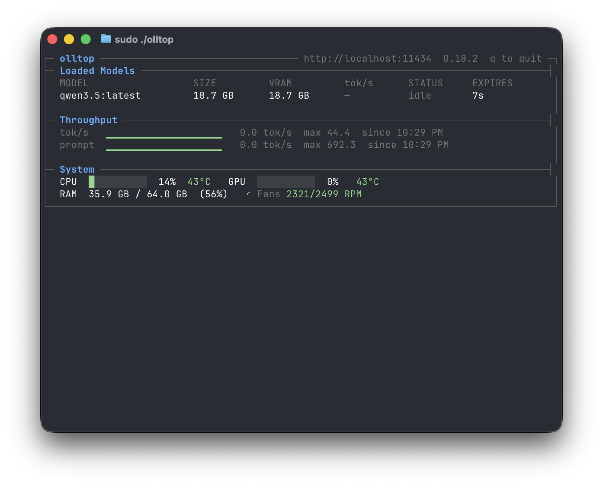

# olltop

A `top`-like terminal UI for monitoring [Ollama](https://ollama.com) with real-time tokens/sec display.

-blue)

[](https://github.com/evandhoffman/olltop/releases)



## What it shows

- **Loaded models** — name, size, VRAM, expiry countdown
- **Tokens/sec** — generation and prompt eval throughput (requires root)
- **Sparkline history** — 5-minute sliding window with max tracker
- **System metrics** — CPU, GPU utilization, RAM, temperatures, fan speeds
- **Status** — running/idle per model based on capture activity

## How it works

olltop passively captures Ollama's HTTP responses on the loopback interface using libpcap. When a response completes, the final `"done":true` JSON chunk contains `eval_count` and `eval_duration` — olltop extracts these to compute tok/s.

No proxying, no interception, no modification to Ollama.

| Data | Source | Requires root? |
|---|---|---|
| Loaded models, VRAM, expiry | `GET /api/ps` (polled every 1s) | No |
| Ollama version | `GET /api/version` | No |
| Generation tok/s | pcap: `eval_count / eval_duration` | **Yes** |
| Prompt eval tok/s | pcap: `prompt_eval_count / prompt_eval_duration` | **Yes** |
| CPU %, RAM | gopsutil | No |
| GPU utilization % | IOKit (AGXAccelerator) | No |
| CPU/GPU temperature | SMC via IOKit | No |
| Fan speeds | SMC via IOKit | No |

## Installation

### Download binary

Grab the latest release from [GitHub Releases](https://github.com/evandhoffman/olltop/releases):

```bash
chmod +x olltop-darwin-arm64
sudo ./olltop-darwin-arm64
```

### Build from source

Requires Go 1.21+ and macOS (Apple Silicon).

```bash
git clone https://github.com/evandhoffman/olltop.git
cd olltop
make build
sudo ./olltop
```

## Usage

```
Usage: olltop [flags]

Flags:
  --host string    Ollama host URL (default: $OLLAMA_HOST or http://localhost:11434)
  --debug          Enable debug logging (writes to olltop.log)
  --version        Print version and exit
```

**Full mode** (with root): `sudo olltop` — shows tok/s, models, system metrics

**Degraded mode** (without root): `olltop` — shows models and system metrics, tok/s unavailable

### Configuration priority

| Priority | Source |
|---|---|
| 1 (highest) | `--host` flag |
| 2 | `$OLLAMA_HOST` env var |
| 3 (default) | `http://localhost:11434` |

## Platform support

- **macOS on Apple Silicon (arm64)** — fully supported
- Linux — planned (eBPF), not yet implemented
- Intel Mac / Windows — not supported

## Architecture

```
cmd/olltop/main.go              # entry point, CLI flags, privilege detection, wiring
internal/
├── capture/
│   ├── capture.go               # Backend interface + EvalMetrics type
│   └── pcap_darwin.go           # macOS: libpcap on lo0, TCP reassembly, JSON extraction
├── ollama/
│   ├── client.go                # HTTP client for /api/ps, /api/version with polling
│   ├── client_test.go           # Tests
│   └── types.go                 # ModelInfo, Snapshot types
├── metrics/
│   ├── aggregator.go            # Merge polling + capture data, rolling history, system metrics
│   └── types.go                 # DisplaySnapshot, ModelDisplay, ThroughputInfo
└── tui/
    └── app.go                   # bubbletea TUI with sparklines, model table, system bars
```

## Known limitations

- **tok/s only appears after a response completes** — the `eval_count`/`eval_duration` fields are only in the final `"done":true` chunk, not during streaming. Real-time during-generation tracking is a planned enhancement.
- **Requires root** for tok/s — this is inherent to pcap on loopback.

## License

MIT
